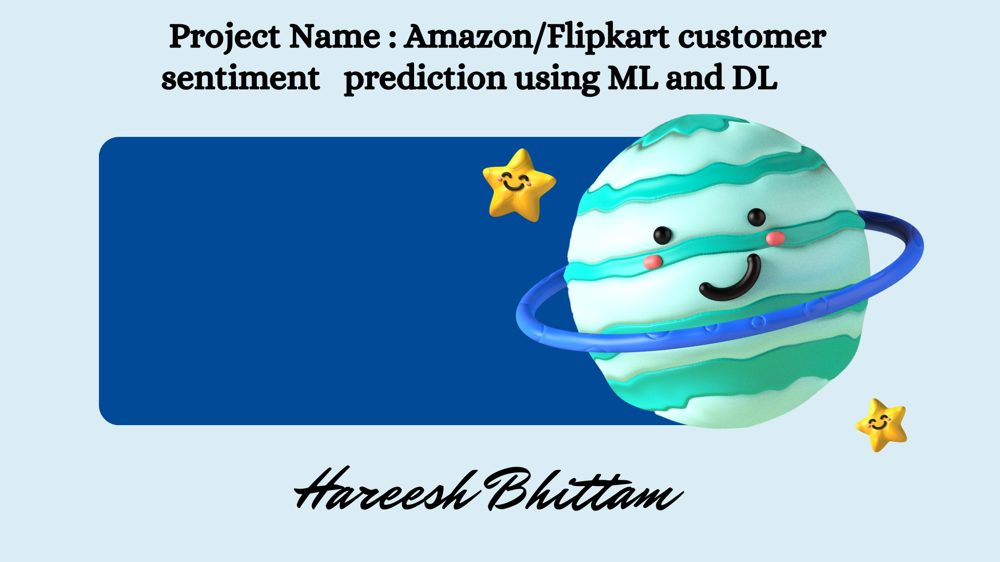
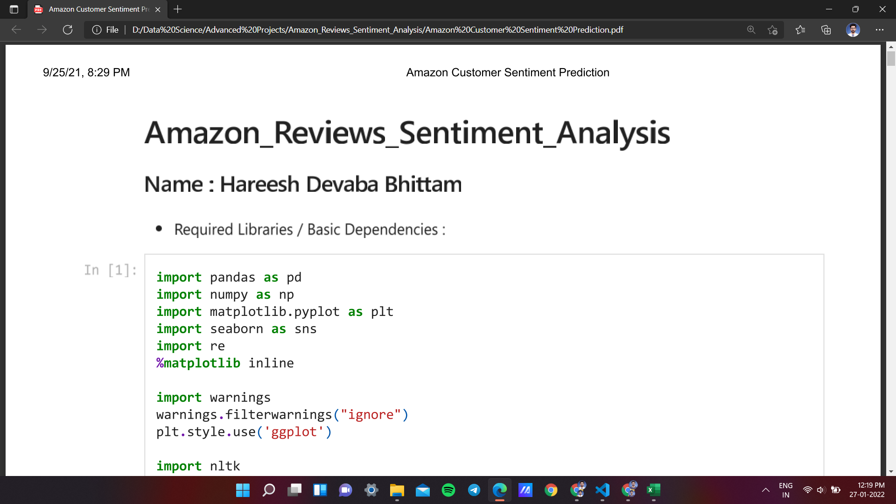
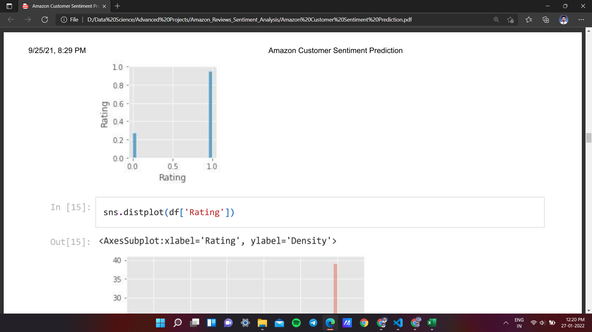
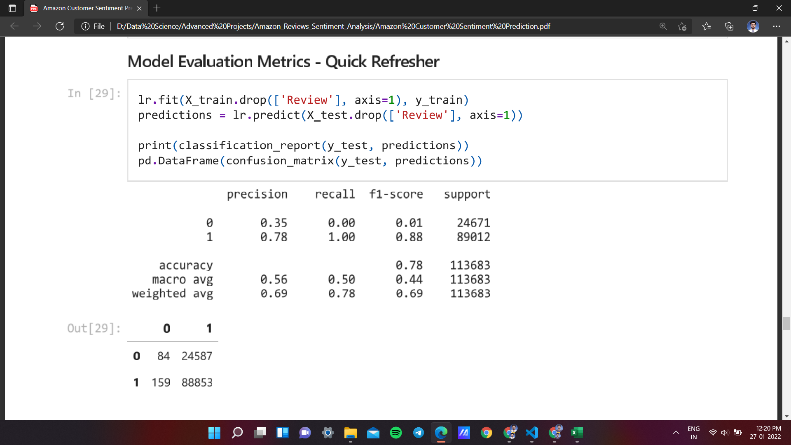
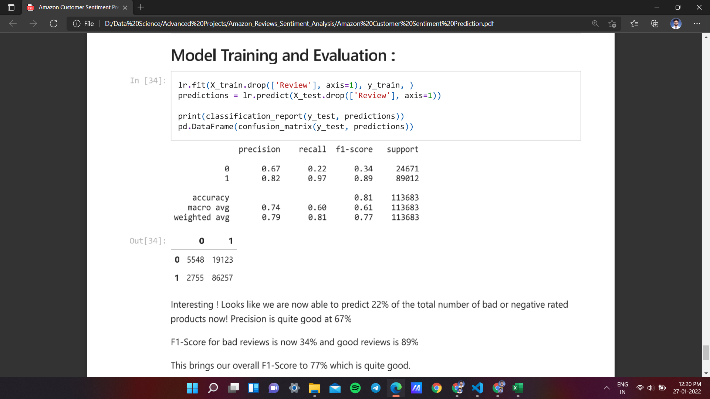

# REGEX SOFTWARE INTERSHIP PROJECT

## Project Name- Amazon/Flipkart customer sentiment prediction using ML and DL

## About:
- Process of computationally identifying from text to check buyer emotion
tone behind text towards product is Positive or Negative.
- Used Natural Language Processing (NLP) to understand and potentially
generate human language.
- The aim is to Up-selling opportunities, Agent monitoring, Training chatbots, Handling multiple customers etc..
- TextBlob is an excellent open-source library for performing NLP tasks

## Project Idea: Customers on flipkart or amazon providing product rating and review. Some are
- positive, some are negative. We can predict customer’s sentiment to classify customers and can use
those insights to increase sells.

# Datasets:
- https://drive.google.com/drive/folders/1s4EQIUQxGYn4SMaXAvj2nmRPUrzrMJrO?usp=shari
ng
- https://drive.google.com/drive/folders/1h5_9VUeCbfrF7sGuIlz1gRbPke7nuw9K?usp=sharin
g

Steps:
1. Data collection (I can Provide)
2. Data preparation
3. EDA
4. Feature engineering
5. Model creation

## Please watch this project demo and explanation video :
- Click Above Thumbnail

## Below you will find sample images :)

### CODE

### THANK YOU !

